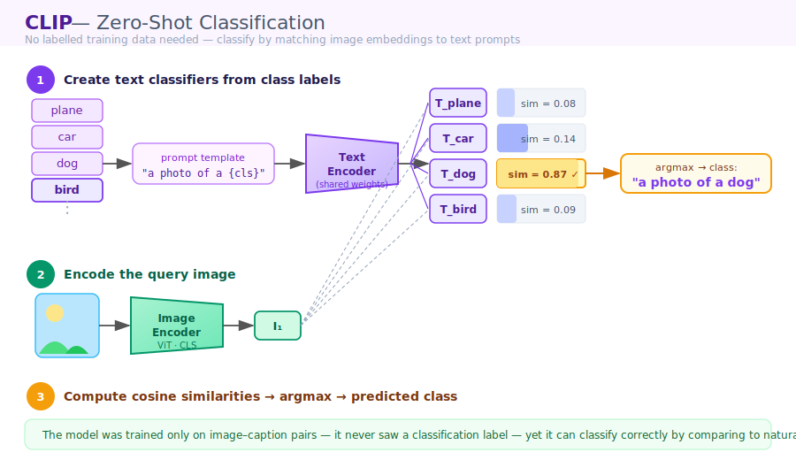
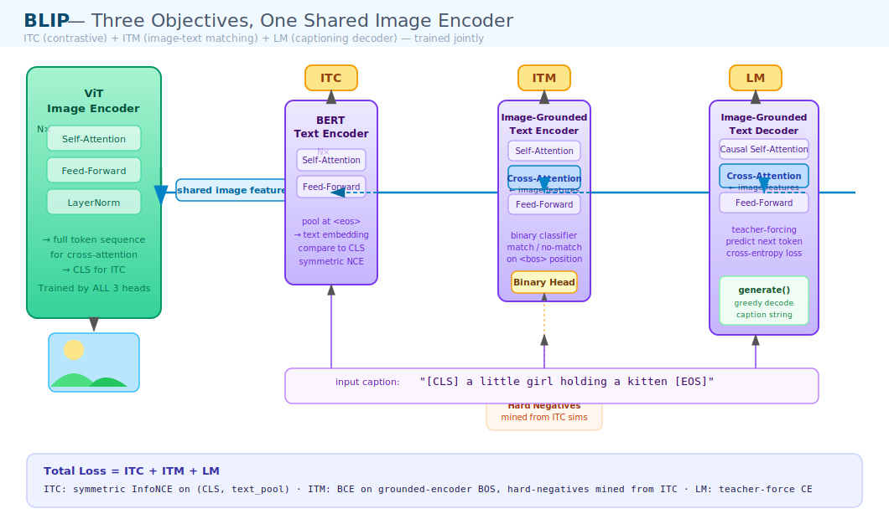

<div align="center">

# CLIP & BLIP from Scratch

**A line-by-line implementation of contrastive vision–language pre-training**  
Trainable on a single GPU (or free Colab) using the Flickr8k dataset

[](https://python.org)
[](https://pytorch.org)
[](https://github.com)
[](LICENSE)

</div>

---

Most "from scratch" repos stop at a single model and hand-wave the math.  
This one builds the **entire vision–language stack from primitives** — attention by hand, a Vision Transformer, a text Transformer, the contrastive objective — then extends it to **BLIP** with image-text matching and captioning. Every file maps to one idea. The contrastive loss is derived, not imported.

---

## Architecture

### CLIP — Contrastive Pre-training

Two encoders project images and captions into a **shared unit-norm embedding space**.  
For a batch of N pairs, the N×N similarity matrix should have its highest values on the diagonal (the matching pairs). Training maximises the diagonal and minimises everything else.

<p align="center">
  
</p>

**Symmetric InfoNCE loss** — the entire `clip_contrastive_loss()` in one line of math:

$$\mathcal{L} = \frac{1}{2}\Big(\text{CE}(e^\tau \cdot IE\cdot TE^\top,\; y) + \text{CE}(e^\tau \cdot TE\cdot IE^\top,\; y)\Big), \quad y = [0,1,\dots,N{-}1]$$

where $\tau$ is a learnable temperature stored in log-space and clamped for stability.

---

### CLIP — Zero-Shot Classification

The signature trick: classify images the model **was never trained to label**, by comparing each image embedding to text prompts like *"a photo of a {class}"*.

<p align="center">
  
</p>

No fine-tuning. No labelled data. Just prompt engineering and cosine similarity.

---

### BLIP — Three Objectives, One Shared Image Encoder

BLIP goes beyond contrastive learning by adding **image-text matching** and a **captioning decoder** — all trained jointly over the same image features.

<p align="center">
  
</p>

| Objective | Head | What it learns |
|-----------|------|---------------|
| **ITC** | Contrastive (same as CLIP) | Pull matching (image, text) pairs together in embedding space |
| **ITM** | Binary classifier on `<bos>` of the grounded encoder | Decide "do this image and caption match?" using hard negatives mined from ITC similarities |
| **LM** | Causal decoder with cross-attention to image | Generate captions token-by-token; `generate()` does greedy decoding at inference |

Total loss = **ITC + ITM + LM**, all computed over the same batch.

---

## Repository structure

```
clip-blip-from-scratch/
│
├── assets/                     ← architecture diagrams (original SVGs)
│   ├── clip_training.svg
│   ├── clip_zeroshot.svg
│   └── blip_architecture.svg
│
├── data/                       ← Flickr8k downloads here (git-ignored)
│
├── src/
│   ├── config.py               ← ALL hyperparameters in one dataclass
│   │
│   │   ── Phase 1: Data ──
│   ├── download.py             ← fetch Flickr8k from Kaggle
│   ├── tokenizer.py            ← word-level tokenizer built from captions
│   ├── dataset.py              ← Dataset, by-image splits, transforms, DataLoaders
│   ├── sanity_check.py         ← verify shapes + save a batch preview image
│   │
│   │   ── Phase 2: Model ──
│   ├── layers.py               ← attention + transformer blocks written by hand
│   ├── vision.py               ← Vision Transformer (patch embed → CLS)
│   ├── text.py                 ← text Transformer (token embed → <eos> pool)
│   ├── clip.py                 ← CLIP model + contrastive loss + accuracy metric
│   │
│   │   ── Phase 3: Train ──
│   ├── train.py                ← CLIP training loop (cosine LR, AMP, checkpointing)
│   │
│   │   ── Phase 4: Evaluate ──
│   ├── eval.py                 ← Recall@K · zero-shot CIFAR-10 · qualitative demo · t-SNE
│   │
│   │   ── Phase 5: BLIP ──
│   ├── blip.py                 ← BLIP (ITC + ITM + LM) + greedy generate()
│   └── train_blip.py           ← BLIP training loop
│
├── requirements.txt
├── .gitignore
├── LICENSE
└── README.md
```

---

## Installation

```bash
git clone https://github.com/<your-username>/clip-blip-from-scratch.git
cd clip-blip-from-scratch
pip install -r requirements.txt
```

> All scripts are run as modules (`python -m src.train`) from the repo root so relative imports resolve cleanly. CUDA is recommended for full training; everything also runs on CPU for quick tests.

---

## Dataset

**Flickr8k** — ~8,000 images, 5 human captions each (~40,000 image–text pairs), ~1 GB total.

```bash
# Step 1: download (requires Kaggle API token at ~/.kaggle/kaggle.json)
python -m src.download

# Step 2: verify everything looks right before training anything
python -m src.sanity_check
```

The sanity check prints batch shapes, decodes a few captions, and saves `data/sanity_batch.png` so you can eyeball that images and captions actually match. **Run this first. It catches 80% of data bugs before they waste GPU time.**

---

## Quickstart commands

### Phase 1 — Data

```bash
python -m src.download          # fetch Flickr8k → data/flickr8k/
python -m src.sanity_check      # verify batch shapes + save preview
```

### Phase 2 — Model (no training needed, just build and inspect)

```python
from src.config import Config
from src.clip import CLIP
cfg = Config()
model = CLIP(cfg, vocab_size=5000, pad_id=0)
print(sum(p.numel() for p in model.parameters()), "parameters")
```

### Phase 3 — Train CLIP

```bash
# ALWAYS run this first — loss on one fixed batch must fall to ~0
python -m src.train --overfit 200

# Full training (add --amp for mixed precision on CUDA)
python -m src.train --epochs 30
python -m src.train --epochs 30 --amp
```

### Phase 4 — Evaluate CLIP

```bash
# Image→Text and Text→Image Recall@1/5/10 on the test split
python -m src.eval --task retrieval

# Zero-shot CIFAR-10 (downloads CIFAR-10 automatically)
python -m src.eval --task zeroshot

# Top-5 images for a text query  →  saves assets/retrieval_demo.png
python -m src.eval --task qualitative --query "a dog running on grass"
python -m src.eval --task qualitative --query "two children playing football"

# t-SNE of the joint embedding space (requires scikit-learn)
python -m src.eval --task tsne
```

### Phase 5 — Train BLIP

```bash
# Sanity check — all three losses (ITC + ITM + LM) must fall on a fixed batch
python -m src.train_blip --overfit 200

# Full training
python -m src.train_blip --epochs 30
python -m src.train_blip --epochs 30 --amp
```

---

## Key design decisions

**Attention is written from scratch.** No `nn.MultiheadAttention`. `layers.py` implements `scaled_dot_product_attention`, `MultiHeadAttention` (works as self- *and* cross-attention), `FeedForward`, `EncoderBlock`, and the masking helpers (`key_padding_bias`, `causal_bias`). The attention math lives in exactly one place.

**Splits are by image, not by caption.** `dataset.py` groups all 5 captions per image before splitting. If you split by row, captions from the same image appear in both train and test — instant leakage.

**Tokenizer is built from train captions only.** `tokenizer.py` uses a word-level vocabulary with `<pad>/<bos>/<eos>/<unk>`. The tokenizer is fit on training captions, then saved alongside the checkpoint so eval uses the same vocabulary.

**Overfit-one-batch is the first training step, always.** If `--overfit 200` cannot drive the loss to ~0 on a single batch, something is wrong with the masking or the loss — and that's the cheapest possible time to find out.

**BLIP uses hard negatives from ITC.** For each image, the hardest negative caption is the most similar *mis*-matched caption according to the live ITC similarity matrix. This is computed in-batch with no extra data.

---

## Configuration reference

All hyperparameters live in `src/config.py` as a single `@dataclass`.

| Field | Default | Notes |
|-------|:-------:|-------|
| `image_size` | `128` | Small for fast demo epochs; set to `224` for stronger results |
| `patch_size` | `16` | ViT patch size (image_size must be divisible by this) |
| `max_length` | `32` | Caption token cap incl. `<bos>`/`<eos>` |
| `vision_dim` / `text_dim` | `256` | Encoder width — keep equal for BLIP cross-attention |
| `vision_layers` / `text_layers` | `6` | Transformer depth |
| `vision_heads` / `text_heads` | `8` | Attention heads |
| `projection_dim` | `256` | Shared embedding space dimension |
| `batch_size` | `64` | Larger batches = more negatives = better contrastive learning |
| `lr` | `1e-4` | AdamW base learning rate |
| `weight_decay` | `0.1` | AdamW weight decay |
| `epochs` | `30` | Full training epochs |
| `min_word_freq` | `2` | Words appearing fewer times → `<unk>` |

---

## Results

> Fill in after training — the eval scripts print exactly these numbers.

### Image–text retrieval (Flickr8k test split, 1,000 images)

| Model | I→T R@1 | I→T R@5 | I→T R@10 | T→I R@1 | T→I R@5 | T→I R@10 |
|-------|:-------:|:-------:|:--------:|:-------:|:-------:|:--------:|
| CLIP (from scratch) | — | — | — | — | — | — |

### Zero-shot CIFAR-10 accuracy

| Model | Accuracy |
|-------|:--------:|
| CLIP (from scratch, Flickr8k) | — |

---

## Roadmap

- [ ] Flickr30k / MS-COCO Karpathy splits for full benchmark numbers
- [ ] BPE tokenizer (replace the word-level one)
- [ ] Optional pretrained backbone flag for stronger zero-shot
- [ ] Beam search in `generate()`
- [ ] BLIP CapFilt caption bootstrapping
- [ ] CC3M subset for web-scale pre-training

---

## References

- Radford et al. *Learning Transferable Visual Models From Natural Language Supervision* (CLIP), 2021.
- Li et al. *BLIP: Bootstrapping Language-Image Pre-training for Unified Vision-Language Understanding and Generation*, 2022.
- Dosovitskiy et al. *An Image is Worth 16×16 Words: Transformers for Image Recognition at Scale* (ViT), 2021.
- Hodosh et al. *Framing Image Description as a Ranking Task* (Flickr8k), JAIR 2013.

The architecture diagrams in `assets/` are original works drawn for this repository.

---

## License

[MIT](LICENSE) · Made by [Lokendra Kumar](https://github.com/<your-username>)
